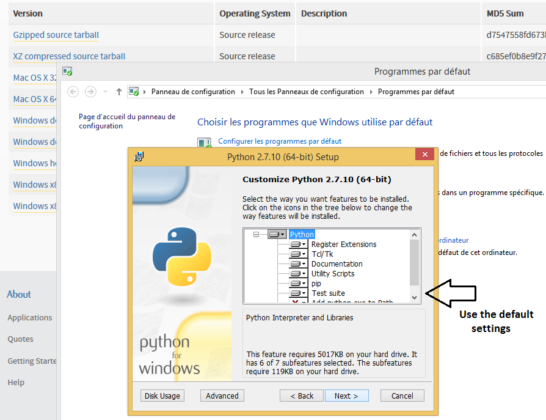

# Setting up Python to visualize and process raw data from a microcontroller #

Current industrial and consumer electronic applications vastly rely on embedded systems to capture and process real-time physical phenomena, such as temperature, force, angular velocity, pressure, humidity, etc. In many cases, the real-time processed data obtained by the embedded system is required to be sent to PC for further processing, analysis, monitoring, and visualization. 

This tutorial presents an introductory step-by-step procedure to perform such operations on PC using Python and the intelligent Integrated Development Environment (IDE), i.e., PyCharm. As the target embedded system, we make use of our Neblina module, which features an ARM Cortex M0+ microcontroller, a Bluetooth Low Energy (BLE) chip by NORDIC, a 9-axis Magnetic Angular Rate and Gravity (MARG) sensor array by STMicroelectronics, and a power management module. However, the Python front-end application can be integrated with other microcontrollers as well.

## Installing Python for Windows ##

As of Aug. 2015, you can download the latest version of Python for Windows, e.g., Python 2.7.10, from the following link:

[https://www.python.org/downloads/windows/]()

If you are using a 64-bit machine, download "**Windows x86-64 MSI installer**", otherwise, for a 32-bit machine, you can download the "**Windows x86 MSI installer**". 

For the 64-bit machine, you will get the file  "**python-2.7.10.amd64**", which you can execute and follow the instructions to install Python for Windows on your system as shown below:

Note that the destination folder you choose for installation here should be used later for all further installations of Python packages. Here we choose: the default address C:\Python27\

You can choose the default settings for the Python installation:

Alternatively, you can similarly download and install Python for other operating systems, e.g., MAC OS, from the python.org webpage.

## Installing PyCharm for Windows ##

Now that you have Python installed, you will likely want a nice environment to work in.  PyCharm is a good tool to get you going.  Other editors are great too and Python can be used with Eclipse, GVIM or the Idle development environment.

From the link below, you can download the free Community Edition of PyCharm by choosing your operating system first, and then by clicking on “**Download Community**”:

For Windows, you will get the executable file e.g. “pycharm-community-4.5.3”, which will guide you through the PyCharm IDE installation as shown below:

When you open PyCharm for the first time, it will prompt you with the following menus:

After the program is launched you can click on Configure->Settings to open the settings menu:

Next, we will define a default interpreter for PyCharm by choosing “Project Interpreter” from “Default Project” menu.

Next, choose your installed Python as the project interpreter. Note that if you have successfully installed Python already, you should be able to see the Python version as an available option for the Project Interpreter:

When you choose Python as your project interpreter, you will find all the packages installed as well (here we have only “pip” and “setuptools”):

Then, hit “OK”. 
It is also possible to add multiple interpreters customized for each project. Many advanced options also exist to customize and improve the Editor environment in PyCharm for your convenience. For further information on such topics, you can read the following guide:

[https://www.jetbrains.com/pycharm/quickstart/]()

## Installing Python Packages for Windows ##
Most Python packages for Windows or other operating systems can be independently downloaded from their appropriate webpages, and be installed on your PC. Here, are a few examples:

### PyQt4: Python bindings for the Qt cross platform GUI toolkit ###

Available for download here: [http://sourceforge.net/projects/pyqt/files/PyQt4/PyQt-4.11.4/]()

After downloading the package, the executable file will guide you through the installation:

Ensure you choose the same installation path as your pre-installed Python:

### pyqtgraph ###

This package is useful for advanced graph plotting capabilities, and is available for download here: [http://www.pyqtgraph.org/]()

Once again, make sure that you install the package on the same location as your pre-installed Python:

### pygame ###

 For advanced visualizations, this is a useful library.
 
You can use the following link to download and install the correct version of pygame for your machine: [http://www.pygame.org/download.shtml]()

However, if you are using a 64-bit machine running Windows, you should use the unofficial Windows binaries for Python extension packages from the below link:
[http://www.lfd.uci.edu/~gohlke/pythonlibs/]()

You should download the appropriate **.whl** file and copy it to your local address on your PC, where you installed Python within the Scripts folder, e.g., C:\Python27\Scripts\

Next, you can open the command line and use the “pip install <FILENAME>” command to install the package:

### numpy ###

A fundamental package for scientific computing. For a 64-bit machine you can follow the same aforementioned procedure to download the .whl file from [http://www.lfd.uci.edu/~gohlke/pythonlibs/](), copy it to the local Python installation address on your PC, e.g., C:\Python27\Scripts\, and finally use the command line to install numpy:

###	pyserial ###
Package needed for UART serial port communication interface. If the target embedded system uses a virtual COM port like USB to UART, e.g., the FTDI chip, the same package can be used to communicate with the board. You can download and install this package using the command line: “pip install pyserial”

### pyopengl ###
For advanced graphics, this package is highly recommended. You can easily download and install this package from the command line as well, i.e., “pip install pyopengl”

## Sample Python Application to Stream and Visualize Sensor Data From a Target Board ##

TBC